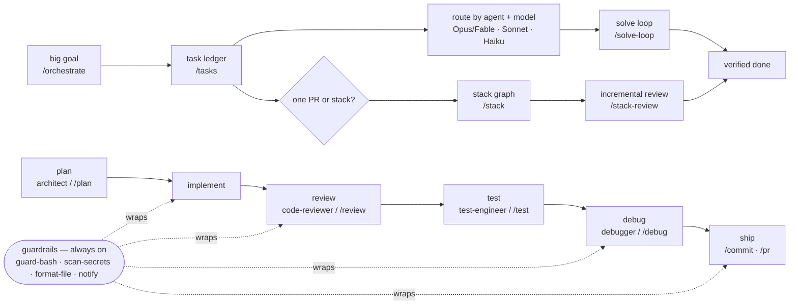

<div align="center">

# 🔨 Forge

**An enterprise-grade Claude Code and Codex toolkit — specialized agents,
progressive-disclosure skills, orchestration loops, slash commands, and safety hooks that
maximize the efficacy of LLMs in software engineering.**

[](https://github.com/AlisinaDevelo/md-files/actions/workflows/ci.yml)
[](LICENSE)
[](https://docs.claude.com/en/docs/claude-code)
[](plugins/forge/agents/)
[](plugins/forge/skills/)
[](plugins/forge/commands/)
[](tests/)
[](evals/)

</div>

---

Forge is a curated, batteries-included configuration for [Claude Code](https://docs.claude.com/en/docs/claude-code)
and a Codex-compatible skill pack. It packages the patterns that make an AI coding agent
genuinely effective — clear role definitions, disciplined methodologies, task ledgers,
model routing, the right tools for each job, and guardrails that keep it safe — into one
installable toolkit. Every artifact is plain Markdown or a small, auditable script: no
build step, no magic, nothing hidden from you.

## Table of contents

- [Why Forge](#why-forge)
- [Install](#install)
- [What's inside](#whats-inside)
  - [Agents](#agents)
  - [Skills](#skills)
  - [Commands](#commands)
  - [Hooks](#hooks)
  - [Output styles, status line & settings](#output-styles-status-line--settings)
  - [Instructions & MCP](#instructions--mcp)
  - [Evidence — evals & tests](#evidence--evals--tests)
- [Release provenance](#release-provenance)
- [How the pieces fit](#how-the-pieces-fit)
- [Repository layout](#repository-layout)
- [Documentation](#documentation)
- [Contributing](#contributing)
- [License](#license)

## Why Forge

LLM coding agents are only as good as the scaffolding around them. The same model
produces dramatically different results depending on whether it has a sharp role, a
proven method, scoped tools, and guardrails. Forge encodes that scaffolding:

- **Specialists, not a generalist.** Twenty agents each with a focused role, a concrete
  methodology, scoped tools, and a defined output format — a reviewer that thinks like a
  reviewer, a debugger that finds root causes, an auditor that traces taint to sinks.
- **Orchestration for big work.** Plan at Opus/Fable, decompose into a task ledger, route
  implementation to Sonnet, fan out mechanical work to Haiku, and iterate to verified done.
- **Stacked delivery, now native.** Design and verify dependent PRs with a portable stack
  manifest, default to GitHub's first-party `gh stack`, or adapt the same safety protocol
  to vanilla GitHub, Graphite, Aviator, Sapling, and classic ghstack.
- **Authorization before effects.** Declarative policy profiles bind exact actions to
  principals, resources, revisions, and one-use approvals, with staged previews and
  committed-effect receipts for GitHub mutations, releases, and production workflows.
- **Discoverability without bloat.** `/forge`, [CATALOG.md](CATALOG.md), bundles, and
  workflows route work to the smallest useful capability instead of dumping every skill
  into context.
- **Canonical capability contract.** A body-aware v2 graph records component identity,
  instructions, tools, permissions, resources, eval links, and explicit Claude/Codex/
  Agent Skills projections so host compatibility is reviewable and drift fails the gate.
  See
  [Capability IR](docs/capability-ir.md).
- **Methodology on tap.** Twenty-five skills inject battle-tested practices — TDD,
  root-cause debugging, threat modeling, safe migrations, orchestration, catalogs, task
  ledgers, and solve loops — exactly when the situation calls for them.
- **One-keystroke workflows.** Twenty-two slash commands wrap the everyday loop: forge,
  review, test, debug, plan, commit, PR, orchestrate, tasks, solve-loop, stack, stack-review.
- **Safety by default.** Lifecycle hooks block catastrophic commands and secret leaks,
  auto-format edits, inject repo context at session start, and notify you on completion —
  deterministically, without relying on the model to remember.
- **Proven, not asserted.** A real eval harness scores prompts and high-risk behavior
  contracts (312 deterministic checks plus cross-host scenarios and an opt-in LLM judge);
  175 tests cover safety hooks, task sync, receipts, doctor, policy, stacks, marketplace readiness, capability graph, rendering, and conformance. Run
  them yourself — `just check`.
- **Auditable & self-validating.** Read every prompt and script. CI validates structure,
  runs the tests, and scores the evals on every push. GitHub-backed task ledgers add stable
  issue identity, native task graphs, conflict stops, and resumable evidence.

## Install

**Claude Code plugin (recommended — includes agents, commands, and hooks):**

```bash
# In Claude Code:
/plugin marketplace add AlisinaDevelo/md-files
/plugin install forge@forge
```

**Codex plugin (skills and orchestration methods):**

```bash
codex plugin marketplace add AlisinaDevelo/md-files
codex plugin add forge@forge
```

Repository marketplace installation is available for both hosts. Forge has not been
submitted to the public Claude or Codex directories; see [Marketplace readiness](docs/marketplace-readiness.md)
for the dated publication state, publisher surfaces, and submission evidence.

**As user-level symlinks (Claude agents, skills, commands):**

```bash
git clone https://github.com/AlisinaDevelo/md-files.git && cd md-files
./scripts/install.sh        # or --copy / --dry-run
```

**As `.agents` skills (Codex and Zed):**

```bash
git clone https://github.com/AlisinaDevelo/md-files.git && cd md-files/zed
./install.sh                # installs Forge skills into ~/.agents/skills
```

**Cherry-pick:** everything is plain Markdown — copy any file into your own `~/.claude/`
or project `.claude/`. See [docs/getting-started.md](docs/getting-started.md) for details.

## What's inside

### Agents

Delegated, autonomous specialists with their own context and scoped tools.

| Agent | Role |
|-------|------|
| [`code-reviewer`](plugins/forge/agents/code-reviewer.md) | Severity-ranked review for correctness, security, and maintainability |
| [`debugger`](plugins/forge/agents/debugger.md) | Hypothesis-driven root-cause diagnosis |
| [`security-auditor`](plugins/forge/agents/security-auditor.md) | Defensive vulnerability review (OWASP/CWE, taint→sink) |
| [`test-engineer`](plugins/forge/agents/test-engineer.md) | Behavior-focused tests that reduce real risk |
| [`architect`](plugins/forge/agents/architect.md) | Implementation plans and architectural trade-offs |
| [`refactoring-specialist`](plugins/forge/agents/refactoring-specialist.md) | Behavior-preserving structural improvement |
| [`performance-optimizer`](plugins/forge/agents/performance-optimizer.md) | Measure-first bottleneck diagnosis and fixes |
| [`database-expert`](plugins/forge/agents/database-expert.md) | Schema design, query tuning, safe migrations |
| [`api-designer`](plugins/forge/agents/api-designer.md) | Consistent, evolvable API contracts |
| [`frontend-specialist`](plugins/forge/agents/frontend-specialist.md) | Component architecture, state, render performance |
| [`accessibility-auditor`](plugins/forge/agents/accessibility-auditor.md) | WCAG audit and remediation |
| [`dependency-auditor`](plugins/forge/agents/dependency-auditor.md) | CVEs, license risk, safe upgrade planning |
| [`devops-engineer`](plugins/forge/agents/devops-engineer.md) | CI/CD, containers, IaC, safe deploys |
| [`docs-writer`](plugins/forge/agents/docs-writer.md) | Accurate, example-driven documentation |
| [`incident-responder`](plugins/forge/agents/incident-responder.md) | Triage, mitigate, then root-cause + postmortem |
| [`code-archaeologist`](plugins/forge/agents/code-archaeologist.md) | Understand unfamiliar/legacy code before changing it |
| [`migration-specialist`](plugins/forge/agents/migration-specialist.md) | Incremental, reversible framework/library/API migrations |
| [`data-engineer`](plugins/forge/agents/data-engineer.md) | Data pipelines, ETL/ELT, warehouse modeling, data quality |
| [`sre`](plugins/forge/agents/sre.md) | SLOs, error budgets, capacity, toil reduction, reliability |
| [`tech-lead`](plugins/forge/agents/tech-lead.md) | Orchestrates large tasks across the specialists |

### Skills

Methodologies and references injected into the current conversation when the situation
matches. Several use **progressive disclosure** — a lean `SKILL.md` plus deeper reference
files loaded only when needed.

| Skill | When it fires |
|-------|---------------|
| [`test-driven-development`](plugins/forge/skills/test-driven-development/) | Implementing test-first (red-green-refactor) |
| [`root-cause-debugging`](plugins/forge/skills/root-cause-debugging/) | Diagnosing a bug or failure |
| [`code-review-rubric`](plugins/forge/skills/code-review-rubric/) | Reviewing code (+ full checklist) |
| [`refactoring-catalog`](plugins/forge/skills/refactoring-catalog/) | Improving structure (+ smell→fix catalog) |
| [`conventional-commits`](plugins/forge/skills/conventional-commits/) | Writing commit messages |
| [`pull-request-authoring`](plugins/forge/skills/pull-request-authoring/) | Opening a reviewable PR |
| [`api-design`](plugins/forge/skills/api-design/) | Designing or reviewing an API |
| [`threat-modeling`](plugins/forge/skills/threat-modeling/) | Security design review (STRIDE) |
| [`safe-database-migrations`](plugins/forge/skills/safe-database-migrations/) | Schema changes on live data |
| [`performance-profiling`](plugins/forge/skills/performance-profiling/) | Investigating performance |
| [`observability`](plugins/forge/skills/observability/) | Adding logs/metrics/traces |
| [`technical-writing`](plugins/forge/skills/technical-writing/) | Writing developer docs |
| [`git-workflow`](plugins/forge/skills/git-workflow/) | Branching, rebasing, conflicts, recovery, bisect |
| [`error-handling`](plugins/forge/skills/error-handling/) | Designing robust failure paths |
| [`feature-flags`](plugins/forge/skills/feature-flags/) | Gating, progressive rollout, and flag cleanup |
| [`caching-strategies`](plugins/forge/skills/caching-strategies/) | Cache patterns, TTLs, invalidation, stampedes |
| [`concurrency-and-parallelism`](plugins/forge/skills/concurrency-and-parallelism/) | Races, locks, async, idempotency |
| [`prompt-engineering`](plugins/forge/skills/prompt-engineering/) | Authoring agents/skills/commands (+ patterns) |
| [`forge-catalog`](plugins/forge/skills/forge-catalog/) | Choose the right Forge command, agent, skill, bundle, or workflow |
| [`orchestration`](plugins/forge/skills/orchestration/) | Multi-model planning, delegation, integration, and verification |
| [`task-ledger`](plugins/forge/skills/task-ledger/) | Jira/GitHub-issue-like local tasks with status, deps, agent, and model |
| [`iterate-to-done`](plugins/forge/skills/iterate-to-done/) | Solve-loop discipline for draining a ledger until done or blocked |
| [`stacked-changes`](plugins/forge/skills/stacked-changes/) | GitHub-native and vendor-neutral stacked PR design, review, native reconciliation, restack, recovery, and landing |
| [`doctor`](plugins/forge/skills/doctor/) | Read-only host, capability, repository-policy, and merge-readiness diagnostics |
| [`policy`](plugins/forge/skills/policy/) | Declarative authorization, staged previews, scoped approvals, and decision receipts |

### Commands

User-triggered prompt templates with argument and shell injection.

| Command | Does |
|---------|------|
| `/forge` | Choose the right Forge agent, skill, command, bundle, or workflow |
| `/review` | Review the current diff, severity-ranked |
| `/commit` | Draft a Conventional Commit for staged changes |
| `/test` | Write tests matching the repo's harness |
| `/debug` | Root-cause a bug before fixing |
| `/plan` | Step-by-step implementation plan |
| `/refactor` | Behavior-preserving cleanup |
| `/security-scan` | Defensive security review of the diff |
| `/pr` | Draft a PR description from the branch |
| `/optimize` | Measure-first performance fix |
| `/explain` | Explain a file, symbol, or system |
| `/docs` | Write docs grounded in the code |
| `/tidy` | Remove cruft from the diff, behavior-preserving |
| `/changelog` | Draft a changelog entry from commits since the last release |
| `/scaffold` | Scaffold a new module/component matching repo conventions |
| `/orchestrate` | Plan a big goal, create a task ledger, route work by agent/model, and drive it to done |
| `/tasks` | Create, list, update, or GitHub-sync the task ledger |
| `/solve-loop` | Drain ready ledger tasks with verify-before-done discipline |
| `/stack` | Plan, inspect, submit, reconcile, restack, repair, or land dependent pull requests |
| `/stack-review` | Review every stack layer bottom-up against its immediate parent |
| `/doctor` | Run the read-only Forge capability and merge-readiness preflight |
| `/policy` | Evaluate policy, stage effects, issue approvals, authorize, and record outcomes |

### Hooks

Deterministic guardrails the harness runs on lifecycle events — no model memory required.

| Hook | Event | Effect |
|------|-------|--------|
| [`session-context`](plugins/forge/hooks/scripts/session-context.py) | SessionStart | Injects current branch, ahead/behind, dirty count, and recent commits as context |
| [`guard-bash`](plugins/forge/hooks/scripts/guard-bash.py) | PreToolUse(Bash) | Blocks catastrophic commands (`rm -rf /`, force-push to main, fork bombs) |
| [`scan-secrets`](plugins/forge/hooks/scripts/scan-secrets.py) | PreToolUse(Write/Edit) | Blocks writing credentials into files |
| [`format-file`](plugins/forge/hooks/scripts/format-file.sh) | PostToolUse(Write/Edit) | Auto-formats edited files with the installed formatter |
| [`notify`](plugins/forge/hooks/scripts/notify.sh) | Stop | Desktop notification when a turn finishes |

### Output styles, status line & settings

- [`output-styles/`](plugins/forge/output-styles/) — selectable system-prompt modes:
  **Concise Engineer** (answer-first, no preamble) and **Mentor** (teaches the *why* as it
  works). Ship with the plugin; pick one via `/config`.
- [`statusline/`](statusline/) — a status line showing model · dir · git · context% · cost.
- [`settings/`](settings/) — example `settings.json` (permission allowlist, deny rules for
  secrets, status line, output style) to pair with the plugin.

### Instructions & MCP

- [`instructions/`](instructions/) — a `CLAUDE.md` template library, stack-agnostic
  [engineering principles](instructions/engineering-principles.md), and language snippets
  (TypeScript, Python, Go).
- [`mcp/`](mcp/) — example Model Context Protocol server configs with least-privilege
  guidance.

### Evidence — evals & tests

- [`evals/`](evals/) — deterministic prompt-quality and behavior-contract checks, shared
  cross-host scenarios, and an opt-in LLM-judge eval that scores agents against real tasks.
- [`tests/`](tests/) — pytest cases covering safety hooks, task sync, receipts, doctor,
  stacks, and conformance. `just check` runs it all.

## Release provenance

Tagged releases publish deterministic Claude, Codex, and `.agents` bundles with SHA-256
manifests, SPDX SBOMs, GitHub artifact attestations, and an offline verifier. See
[release provenance](docs/release-provenance.md) for consumer verification and the
threat model.

## How the pieces fit



Agents go deep on focused jobs; skills supply the method; commands trigger the loop;
hooks keep it safe. For big tasks, the main conversation acts as the conductor so it can
spawn specialists in parallel; the ledger keeps the run honest. See
[docs/usage-patterns.md](docs/usage-patterns.md).

## Repository layout

```text
.claude-plugin/        Claude Code marketplace manifest
.agents/plugins/       Codex marketplace manifest
data/                  generated catalog, capability graph, bundles, and workflow metadata
plugins/forge/         the Forge plugin
  .claude-plugin/        plugin manifest
  .codex-plugin/         Codex plugin manifest
  agents/                20 specialist subagents
  skills/                25 progressive-disclosure skills
  commands/              22 slash commands
  hooks/                 5 lifecycle hooks (session-context, guard, secrets, format, notify)
  output-styles/         selectable system-prompt modes
instructions/          CLAUDE.md templates, principles, language guides
mcp/                   example MCP server configs
statusline/            status line script
settings/              example settings.json
evals/                 prompt eval harness, shared scenarios, and result evidence
tests/                 runnable hook, task-ledger, receipt, doctor, stack, and conformance tests
docs/                  getting started, usage, architecture, rationale, CI
scripts/               validation, installation, release, and marketplace checks
.github/               CI, issue/PR templates, CODEOWNERS, dependabot
```

## Documentation

- [Getting started](docs/getting-started.md) — install options and first steps
- [Usage patterns](docs/usage-patterns.md) — how the components combine in real workflows
- [Bundles & workflows](docs/bundles-and-workflows.md) — focused capability sets and ordered playbooks
- [Quality bar](docs/quality-bar.md) — validation and safety standards for Forge components
- [Competitive audit](docs/competitive-audit.md) — what Forge borrows from larger skill libraries
- [Stacked changes](docs/stacked-changes.md) — GitHub-native stacks, provider adapters,
  safety model, review flow, CI, and recovery
- [GitHub native stacks](docs/github-native-stacks.md) — remote inspect/import, SHA-guarded
  reconciliation, divergence classes, mutation authority, and preview fallback
- [Policy plane](docs/policy-plane.md) — action envelopes, profiles, approvals, staged
  previews, adapter integration, and privacy-safe decision evidence
- [Cross-host conformance](docs/conformance.md) — shared scenarios, host adapters, live
  evidence, result schemas, and release gates
- [Release provenance](docs/release-provenance.md) — deterministic bundles, SBOMs,
  attestations, offline verification, and threat model
- [Marketplace readiness](docs/marketplace-readiness.md) — honest directory status,
  publisher surfaces, asset policy, and submission smoke-test matrix
- [Capability IR](docs/capability-ir.md) — body-aware graph, deterministic host renderer,
  adapter contract, migration workflow, and current compiler boundary
- [Architecture](docs/architecture.md) — how the repo is organized and why
- [Design rationale](docs/design-rationale.md) — the decisions and trade-offs behind Forge
- [CI & headless usage](docs/ci-and-headless.md) — run Forge in pipelines and automated review
- [Evals](evals/) — the evidence layer · [Tests](tests/) — hook test suite
- [Contributing](CONTRIBUTING.md) — add an agent, skill, command, or hook
- [Changelog](CHANGELOG.md)

## Contributing

Contributions are welcome — new agents, skills, commands, and hooks, or improvements to
existing ones. Run `./scripts/validate.sh` before opening a PR. See
[CONTRIBUTING.md](CONTRIBUTING.md) for the conventions and the quality bar.

## License

[MIT](LICENSE) © Alisina Karimi
