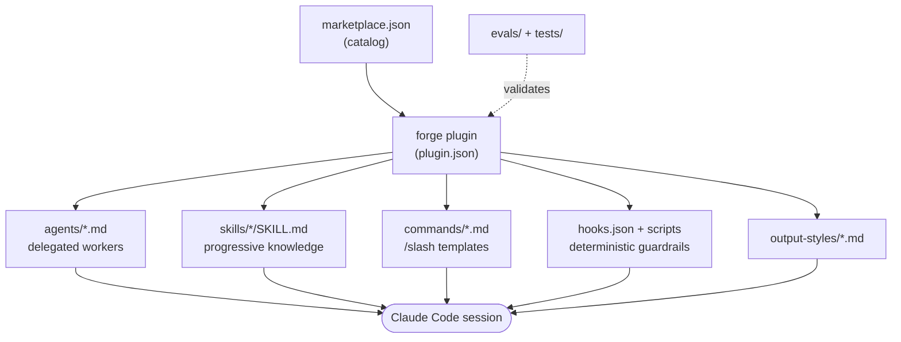
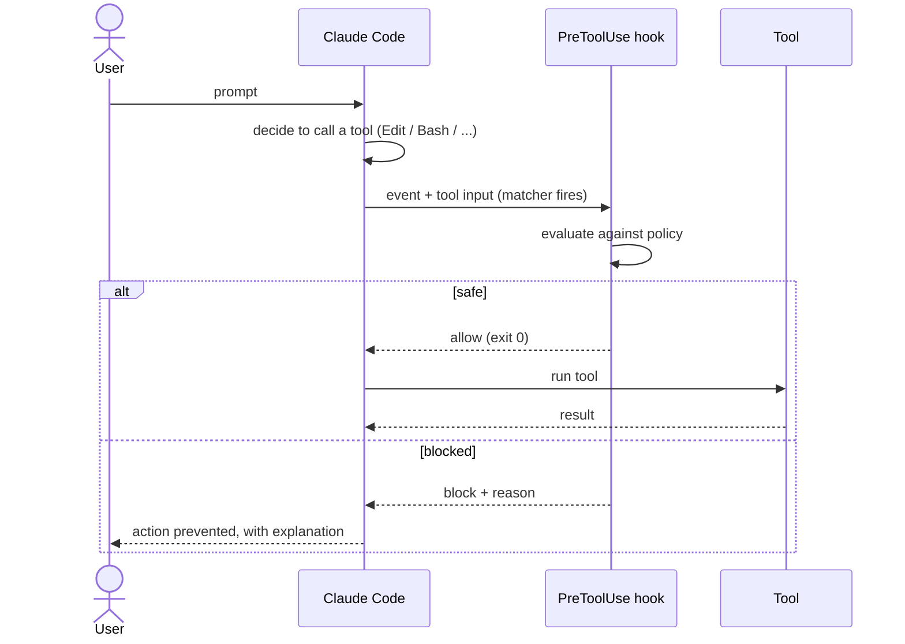
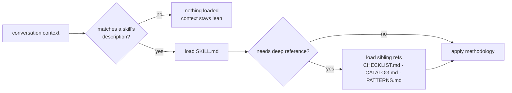

# Architecture

How the repository is organized and why. Forge is a Claude Code **plugin** that doubles
as a browsable library — every artifact is plain Markdown or a small, auditable script.

## Layout

```text
md-files/                       # the marketplace repository
├── .claude-plugin/
│   └── marketplace.json        # catalog: lists the Forge plugin and its source
├── plugins/
│   └── forge/                  # the Forge plugin (source: ./plugins/forge)
│       ├── .claude-plugin/
│       │   └── plugin.json     # plugin manifest (metadata; components auto-discovered)
│       ├── agents/             # subagent definitions (one .md per agent)
│       ├── skills/             # skills (one dir per skill, with SKILL.md + refs)
│       ├── commands/           # slash commands (one .md per command)
│       └── hooks/
│           ├── hooks.json      # hook registrations (events → matchers → scripts)
│           └── scripts/        # the hook implementations (python + bash)
├── instructions/               # CLAUDE.md templates, principles, language snippets
├── mcp/                        # example MCP server configs
├── evals/                      # prompt eval harness + cases (the evidence layer)
├── tests/                      # runnable tests for the hooks
├── docs/                       # this documentation
├── scripts/                    # repo tooling (validate.sh, install.sh)
└── .github/                    # CI, issue/PR templates, CODEOWNERS, dependabot
```

This is the canonical Claude Code **marketplace** structure: the repo root is a
marketplace catalog (`.claude-plugin/marketplace.json`) that lists one plugin whose
`source` resolves to `./plugins/forge`. Keeping the plugin in a subdirectory (rather than
at the marketplace root) avoids the root-source component-scanning edge case and leaves
room to add more plugins to the catalog later.

## The four component types

| Type | Lives in | Loaded | Decides to act on… |
|------|----------|--------|--------------------|
| **Agent** | `plugins/forge/agents/*.md` | on delegation | its `description` (when to invoke) |
| **Skill** | `plugins/forge/skills/*/SKILL.md` | progressively | its `description` (situational trigger) |
| **Command** | `plugins/forge/commands/*.md` | on `/name` | explicit user invocation |
| **Hook** | `plugins/forge/hooks/hooks.json` | always | event + tool matcher |

**Agents** are delegated, autonomous workers with their own context window and scoped
tools — use them for focused, multi-step jobs (review, debug, audit). **Skills** inject
expertise into the *current* conversation when the situation matches their description —
use them for methodology and reference knowledge. **Commands** are user-triggered prompt
templates with argument and shell injection. **Hooks** are deterministic shell programs
the harness runs on lifecycle events — use them for guardrails and automation that must
not depend on the model remembering.

Beyond these four, the plugin also ships **output styles** (`output-styles/` — selectable
system-prompt modes), and the repo provides a **status line** script and example
**`settings.json`** that aren't plugin components themselves (they're settings keys) but
round out the configuration. The **evidence layer** (`evals/`, `tests/`) is tooling, not a
runtime component — it proves the components behave as described.

## How the pieces fit



### A hook intercepting a tool call

Hooks are the only deterministic component — the harness runs them on lifecycle events,
so a guardrail never depends on the model remembering it.



### Progressive disclosure of a skill



## Design principles

- **Plain text, auditable.** No build step, no magic. You can read every line of what
  the model will be told and every script that will run.
- **Progressive disclosure.** Skills keep `SKILL.md` lean and push exhaustive references
  into sibling files loaded only when needed (see `code-review-rubric`,
  `refactoring-catalog`).
- **Least privilege.** Read-only agents (reviewers, auditors) get no Edit tool. Hooks
  fail open on parse errors so they can't brick a session, but block hard on real
  threats.
- **Self-validating.** `scripts/validate.sh` checks frontmatter, JSON, and hook scripts;
  CI runs it on every push so the toolkit stays well-formed.
