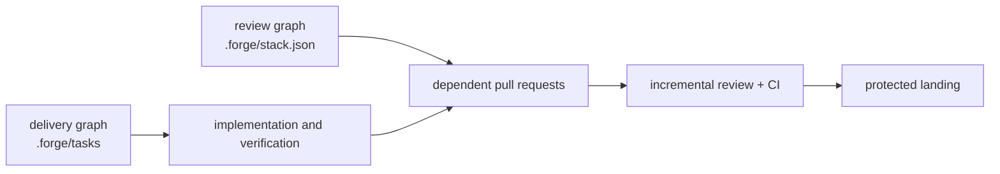

# Stacked Changes

Forge 3.0 treats a large feature as two related graphs:



Task dependencies answer "what can be worked now?" Stack ancestry answers "what should
this PR be compared with and merged after?" Keeping them separate prevents project
planning state from silently rewriting Git history.

## Industry Snapshot: July 2026

GitHub released the first tagged version of its first-party Stacked PRs CLI,
[`gh-stack` v0.1.0](https://github.com/github/gh-stack/releases/tag/v0.1.0), on July 29,
2026 and removed private-preview wording from its docs a day later. Forge treats it as the
best GitHub-native default while still checking repository availability; the CLI documents
exit code `9` for repositories where Stacked PRs are not enabled.

GitHub native stacks now provide the missing platform object: stack id/number, ultimate
base, ordered PRs, position, rules/CI enforcement against the ultimate target, atomic
direct merging, bottom-up merge-queue handling, cascading rebase, and stack webhooks.

| Provider | Best at | Important edge |
|----------|---------|----------------|
| GitHub Stacked PRs | Native GitHub rules, UI, API, CI, and atomic direct merge | New surface; feature availability must be checked per repository |
| Graphite | Mature stack UI, high-throughput queue, speculative CI | Product-specific metadata and repository-rule integration |
| Aviator | Open-source CLI plus configurable merge queue | Sync can overwrite remote-side edits; preflight ownership carefully |
| Sapling | Commit-stack editing, absorb/split/restack, undo | Standard GitHub UI can show cumulative overlapping diffs |
| classic ghstack | Compatibility with established ghstack repositories | Synthetic branches/trailers and nonstandard landing |
| vanilla Git/gh | No extra provider dependency | Forge/user must maintain ancestry, PR bases, navigation, and landing order |

Forge does not reimplement these source-control engines. It adds the agent-facing layer
they do not share: provider selection, explicit safety gates, portable state, review
method, post-command verification, and recovery playbooks.

## Quick Start

The recommended native path:

```bash
gh extension install github/gh-stack
gh stack init --base main feature-schema feature-api feature-ui
gh stack submit
gh stack view
```

Forge's portable verification path:

```bash
python3 plugins/forge/skills/stacked-changes/scripts/forge-stack.py \
  init --provider github --trunk main
python3 plugins/forge/skills/stacked-changes/scripts/forge-stack.py \
  add feature-schema --parent main
python3 plugins/forge/skills/stacked-changes/scripts/forge-stack.py \
  check
python3 plugins/forge/skills/stacked-changes/scripts/forge-stack.py \
  plan submit
```

In Claude Code use `/stack`; in Codex or Zed ask for the `stacked-changes` skill or invoke
`/forge-cmd-stack`.

## The Safety Model

Before mutation:

1. Confirm one provider owns the stack metadata.
2. Require a clean worktree and no active rebase/merge.
3. Fetch and compare local and remote heads.
4. Confirm branch ownership, active review, signed-commit policy, rules, and queue state.
5. Save recovery refs and inspect the exact provider-native plan.

After mutation:

1. Re-check every parent/child ancestry edge.
2. Verify remote heads and last-submitted SHAs, even after exit code zero.
3. Verify PR direct bases, native stack positions, and ultimate base.
4. Confirm required CI and queue membership.
5. Inspect every incremental diff for accidental duplication or lost commits.

Native `gh stack push` uses per-branch force-with-lease checks and can partially update
before another branch's lease is rejected. A direct `gh stack merge` is different: GitHub
documents it as an atomic, all-or-nothing merge operation. Forge models those guarantees
separately instead of assuming every multi-branch operation is atomic.

## CI and Merge Queues

For native GitHub stacks, workflows targeting the ultimate base run for every layer. Stack
metadata is available at `github.event.pull_request.stack`; the `stacked` pull-request
action fires after a PR joins a stack.

For GitHub Merge Queue, required Actions must also listen for `merge_group`:

```yaml
on:
  pull_request:
  merge_group:
    types: [checks_requested]
```

Run fast checks for each reviewable layer, integration checks at the top, and mandatory
queue-time checks against the synthetic merge group. Do not skip a required workflow using
path filters unless another always-reported check handles the skipped case.

## Primary Sources

- [GitHub Stacked PRs overview](https://github.github.com/gh-stack/introduction/overview/)
- [GitHub Stacked PRs CLI](https://github.github.com/gh-stack/reference/cli/)
- [GitHub Stacked PRs workflows](https://github.github.com/gh-stack/guides/workflows/)
- [GitHub Stacked PRs webhooks](https://github.github.com/gh-stack/reference/webhooks/)
- [GitHub Merge Queue](https://docs.github.com/en/enterprise-cloud@latest/repositories/configuring-branches-and-merges-in-your-repository/configuring-pull-request-merges/managing-a-merge-queue)
- [Graphite command reference](https://graphite.com/docs/command-reference/)
- [Aviator CLI manual](https://docs.aviator.co/aviator-cli/manpages/av.1)
- [Sapling stacks](https://sapling-scm.com/docs/overview/stacks/)
- [classic ghstack](https://github.com/ezyang/ghstack)
