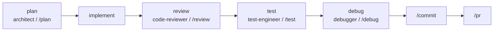

# Usage Patterns

How the agents, skills, commands, and hooks combine in real workflows. The toolkit is
designed so the right capability surfaces at the right moment — these are the seams.

## The development loop

1. **Plan.** For anything non-trivial, start with `/plan` (or the `architect` agent). Get
   a step-by-step plan and surface the risks before writing code.
2. **Implement.** Write the change. The `prompt-engineering`, language, and
   `engineering-principles` instructions keep the model on-style and minimal.
3. **Review.** Run `/review` on the diff. The `code-review-rubric` skill backs the
   severity ranking; the `code-reviewer` agent does the deep pass.
4. **Test.** `/test` writes behavior-focused tests matching your harness; the
   `test-driven-development` skill guides the red-green-refactor loop when you go
   test-first.
5. **Debug.** When something breaks, `/debug` or the `debugger` agent runs the
   hypothesis-driven, root-cause method instead of patching symptoms.
6. **Ship.** `/commit` writes a Conventional Commit; `/pr` drafts the description.

## Specialist deep-dives

Pull in a specialist agent when a task needs depth:

- Touching auth, payments, or user input? → `security-auditor` / `/security-scan`.
- Slow endpoint or memory pressure? → `performance-optimizer` / `/optimize`.
- Schema change on a live DB? → `database-expert` + the `safe-database-migrations` skill.
- Building UI? → `frontend-specialist`, then `accessibility-auditor` before done.
- Before a release? → `dependency-auditor` for CVEs and upgrade planning.

## Orchestrating big work

For a large, ambiguous task, the `tech-lead` agent decomposes it, delegates to the
specialists, integrates their output, and verifies against the definition of done — so
you describe the goal once and get a coherent result.

## Always-on guardrails

The hooks run automatically in the background:

- **Dangerous-command guard** blocks catastrophic shell commands (`rm -rf /`, force-push
  to main, fork bombs).
- **Secret scanner** blocks writing credentials into files.
- **Auto-format** runs your formatter after every edit.
- **Notify** pings you when a turn finishes.

These need no invocation — they shape every session quietly.

## Layering instructions

`~/.claude/CLAUDE.md` (how *you* work) → project `CLAUDE.md` (how *this repo* works) →
nested `CLAUDE.md` (how *this subsystem* works). Lower, more-specific files win. Keep each
short and high-signal.
